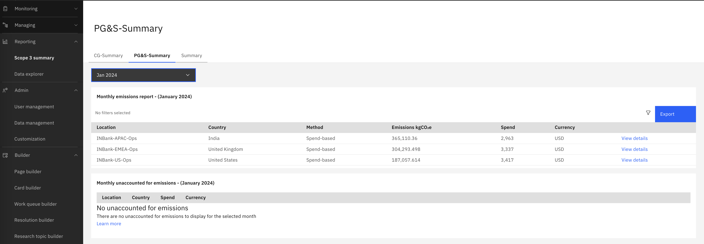
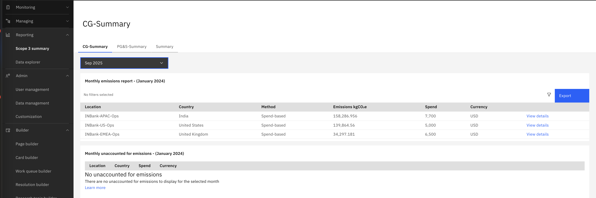

# Leverage SCI Advanced Configurations to Report Emissions by Custom Categories

This guide provides a clear, step-by-step approach for reporting and summarizing emissions in SCI (Supply Chain Intelligence) by custom categories—such as Category 1 (Purchased Goods & Services) and Category 2 (Capital Goods). This helps organizations meet detailed reporting and regulatory requirements with ease.

---

## 1. Why Separate Emissions by Scope 3 Category?

### Why Do Organizations Need to Separate Emissions Reporting by Scope 3 Category?

SCI offers a robust Scope 3 Summary dashboard that automatically aggregates emissions on a monthly basis at the location level for each GHG (Greenhouse Gas) calculation method, including:

- Spend-based
- Average-data
- Hybrid
- Supplier-specific

For example, in our sample organization INBank, there are three purchasing locations:

- INBank-APAC-Ops
- INBank-EMEA-Ops
- INBank-US-Ops

  

As shown in the screenshot, SCI consolidates emissions at the location level for each GHG method. If multiple methods are used, emissions are grouped accordingly, resulting in separate entries per location and method.

These monthly emissions will be exported to Envizi for overall Scope 3 reporting. 

Below is an example of how the exported data appears in Envizi, organized by purchasing location and GHG method.

  

 

  

 
This consolidated approach gives organizations a clear overview of emissions by method and location, simplifying Scope 3 performance management.

However, separating emissions by Scope 3 category—such as Cat 1 (Purchased Goods & Services) and Cat 2 (Capital Goods)—is crucial for meeting regulations, increasing transparency, and supporting sustainability goals. Category-level reporting enables better decision-making, accountability, and targeted action.

**Achieving Granular, Category-Level Reporting with SCI:**

While SCI's default summary provides a strong foundation, organizations can unlock even deeper insights by leveraging SCI's custom and advanced configurations. These features enable:

- More granular, category-level reporting (e.g., by Scope 3 Category 1 and 2)
- Custom grouping, filtering, and visualization by user-defined categories

For instance, IN Bank required their Scope 3 emissions to be reported separately for each category. The following examples show how the data is visualized for each category:

**Scope 3 Category 1: Purchased Goods & Services**

  

**Scope 3 Category 2: Capital Goods**

  

Lets look at the how this can be acheived in SCI in the blow section. 

## 2. Summarizing Emissions for at Scope 3 Cat1 & Cat 2 seperately.

For example our example INBank organization wants to create the seperate summary reports as shwon in the baove section for the two Scope 3 categories 

- **Category 1:** Purchased Goods & Services (PG&S)
- **Category 2:** Capital Goods (CG)

There are two main approaches in SCI for capturing and reporting these categories separately:

1. **Purchasing organization-based approach**
2. **Product category-based approach**

For more details on which approach to chose, please refer  [Envizi SCI documentation](https://www.ibm.com/docs/en/envizi-supply-chain?topic=configuration-configuring-category-1-2).

In this guide,  our example organization INBank preferred  to use the `Product category-based approach` as they  wants to classify their purchases to be categorized as PG&S versus CG.  

This can be acehived by defining a Category L1 ID to be used to designate each product ID as PG&S or CG in the Product-mapping template, then reference this Product category for each product in the Product template.

### 2.1. Model the product and product mapping template to align with the appraoch

Make sure the The steps has to start from modelling the data from the begining. Now, INBank has modeled the product data by defining Category L1 ID as crieteria with the possible values PG&S and CG

Master Products data: 

  

 
Master Products Mapping data: 

  

### 2. Ingest master and transactional data 

Proceed with the other stepts to ingest master data and transactional data into the platform and verify the emissions are calculated

### 2. Ingest master and transactional data 
 

