# Leverage SCI Advanced Configurations to Report Emissions by Custom Categories

This guide provides a clear, step-by-step approach for reporting and summarizing emissions in SCI (Supply Chain Intelligence) by custom categories—such as Category 1 (Purchased Goods & Services) and Category 2 (Capital Goods). This helps organizations meet detailed reporting and regulatory requirements with ease.

---

## 1. Why Separate Emissions by Scope 3 Category?

### Why Do Organizations Need to Separate Emissions Reporting by Scope 3 Category?

SCI offers a robust Scope 3 Summary dashboard that automatically aggregates emissions on a monthly basis at the location level for each GHG (Greenhouse Gas) calculation method, including:

- Spend-based
- Average-data
- Hybrid
- Supplier-specific

For example, in our sample organization INBank, there are three purchasing locations:

- INBank-APAC-Ops
- INBank-EMEA-Ops
- INBank-US-Ops

  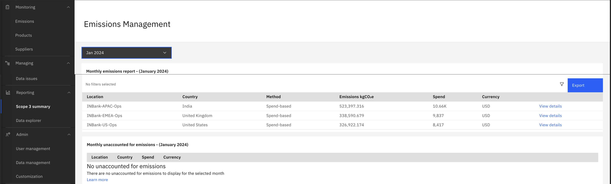

As shown in the screenshot, SCI consolidates emissions at the location level for each GHG method. If multiple methods are used, emissions are grouped accordingly, resulting in separate entries per location and method.

These monthly emissions will be exported to Envizi for overall Scope 3 reporting. 

Below is an example of how the exported data appears in Envizi, organized by purchasing location and GHG method.

  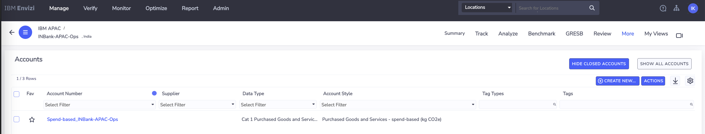

 

  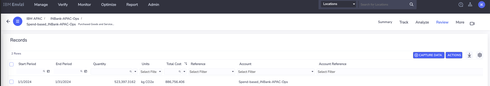

 
This consolidated approach gives organizations a clear overview of emissions by method and location, simplifying Scope 3 performance management.

However, separating emissions by Scope 3 category—such as Cat 1 (Purchased Goods & Services) and Cat 2 (Capital Goods)—is crucial for meeting regulations, increasing transparency, and supporting sustainability goals. Category-level reporting enables better decision-making, accountability, and targeted action.

## Achieving Category-Level Reporting in SCI

SCI enables organizations to generate detailed emissions reports by category, such as Purchased Goods & Services (Category 1) and Capital Goods (Category 2), for enhanced transparency and compliance.

### Example: IN Bank’s Category Reports

IN Bank required their Scope 3 emissions to be reported separately for each category. The following examples illustrate the resulting reports:

**Category 1: Purchased Goods & Services**

  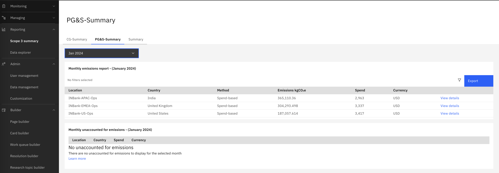

**Category 2: Capital Goods**

  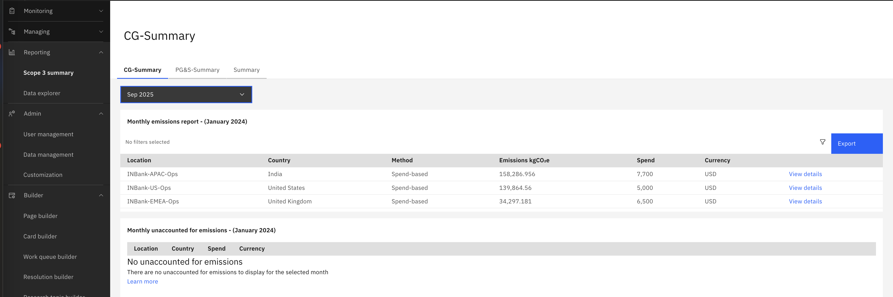

### Approaches to Category-Level Reporting

SCI supports two primary approaches for category-level reporting:

1. By purchasing organization
2. By product category (the approach used by IN Bank)

For further details, refer to the [Envizi SCI documentation](https://www.ibm.com/docs/en/envizi-supply-chain?topic=configuration-configuring-category-1-2).

### Step-by-Step: Setting Up Category-Based Reports

#### Step 1: Prepare Product Data
Ensure your product data includes a field for category (e.g., PG&S or CG), known as the Category L1 ID.

**Master Products Example:**

  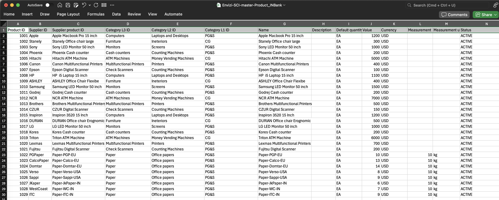

**Product Mapping Example:**

  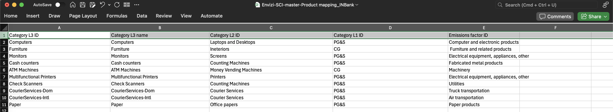

#### Step 2: Load Data
Upload both master and transactional data into SCI, ensuring the category field is populated for each product.

#### Step 3: Review the Default Scope 3 Summary
Navigate to `Reporting > Scope 3 Summary` to view the standard monthly report.

  

#### Step 4: Create a PG&S-Summary  Report 

To generate a report specifically for Category 1 (PG&S):

Step 4.1. **Copy the Summary Page**
   - Go to `Builder > Page builder`
   - Click `Manage pages` (top right)
  

  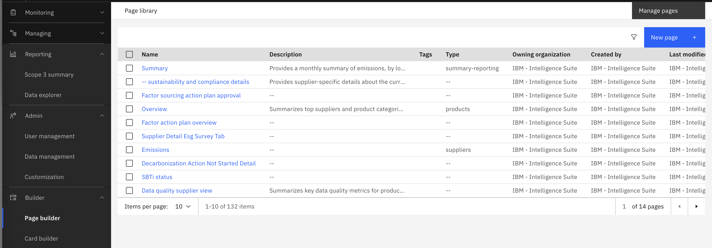

   - Select the `Scope 3 Summary` tab
 

  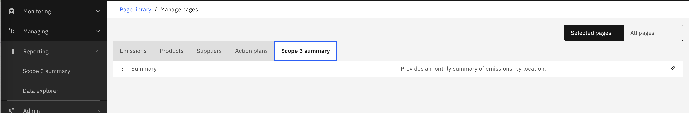

   - Click the pencil icon next to `Summary` to preview
 
   - Click `Copy` (top right) to create a new page
   

  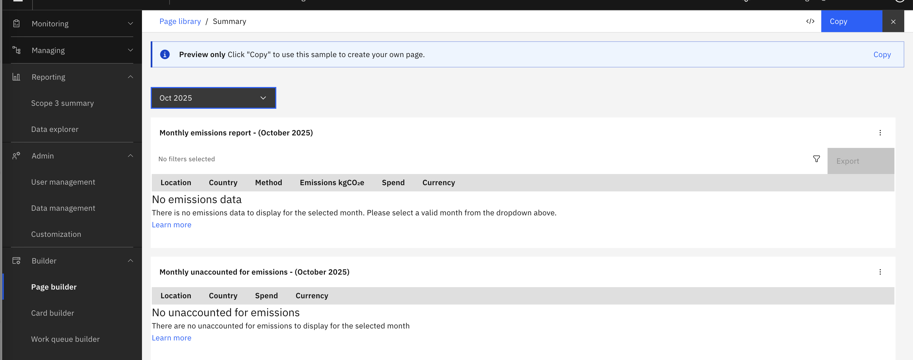

   - Name the new page `PG&S-Summary` (add a description if desired)

  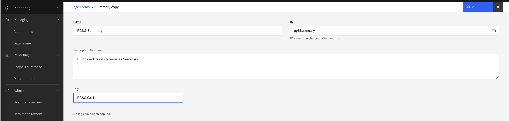

   - Click on `Create`

Step 4.2. **Configure the PG&S-Summary Page**
   
   - Click `Configure` on the new `PG&S-Summary` page
  

  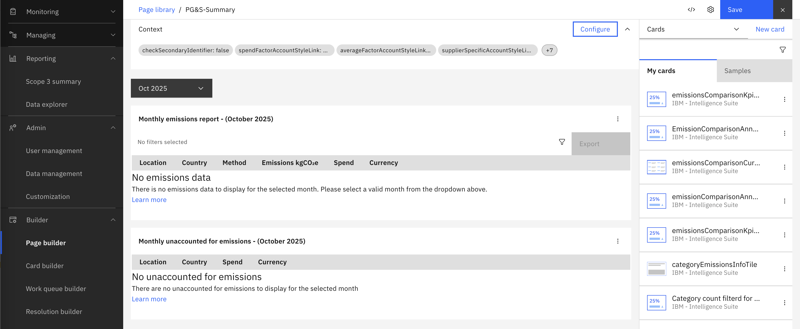

 
   - In the popup, review the context variables (these control the data displayed)

  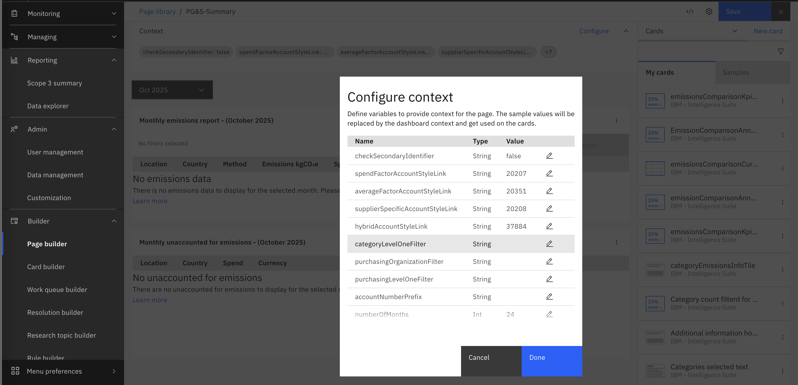

   
   - Set `categoryLevelOneFilter` to `PG&S` (ensure this matches your product data exactly)

  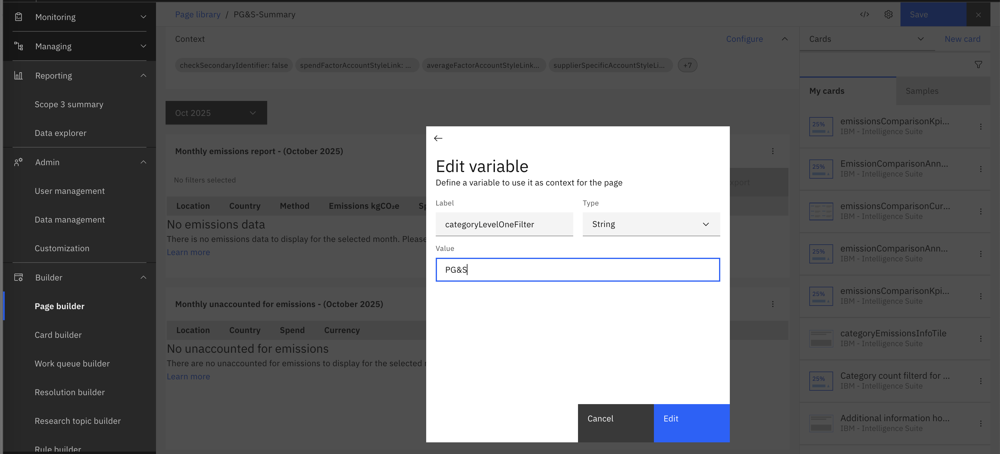

   
   - (Optional) Adjust `numberOfMonths` to specify the number of months for reporting data (e.g., 60)
   - (Optional) Set `accountNumberPrefix` (e.g., `scis-pgs-`) to help organize accounts
   - Leave other settings as default unless customization is required. You can validate the account style link values for the PG&S by looking at the same from Envizi account styles extract report following instructions [here](extractAccountStyleLinks.md)
   - Review your settings:

  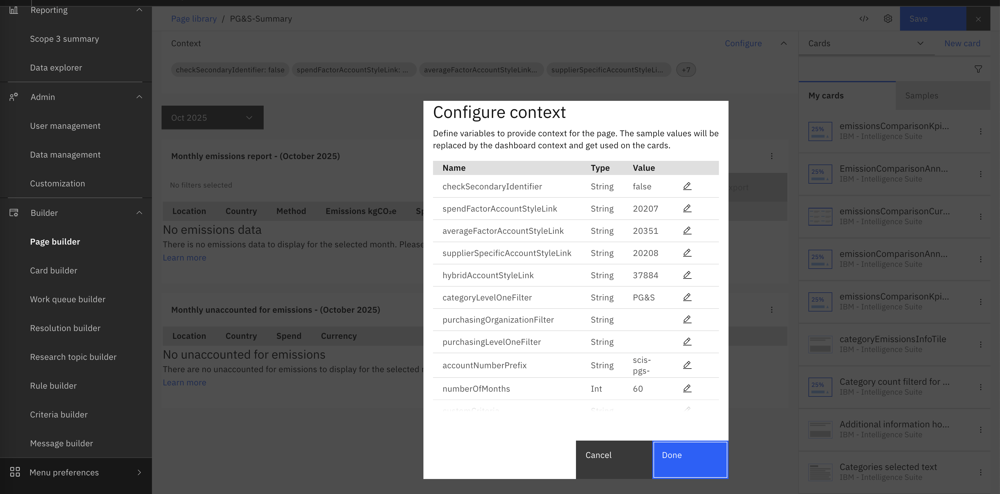

   - Click `Save`
  
Step 4.3. **View the PG&S Summary page**

On the PG&S Summary page, the context variables look like below 

  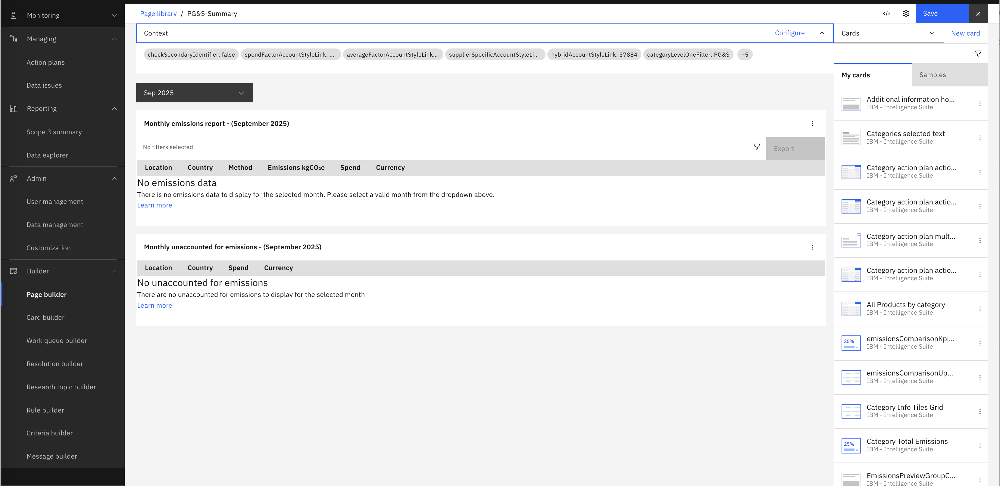

 

Step 4.5. **Access the Custom Report**
   - Go to `Reporting > Scope 3 Summary`
   - Select the `PG&S-Summary` tab
   - Choose a month to view emissions

  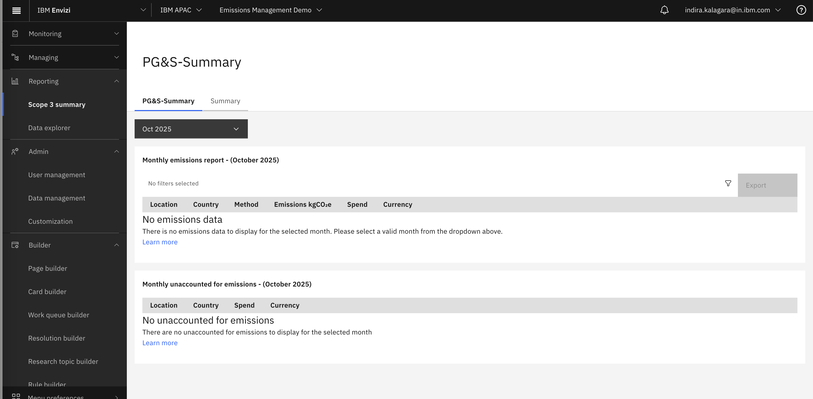

---

#### Step 5: Create a CG-Summary Report

To generate a report specifically for Category 2 (CG):

Step 5.1. **Copy the Summary Page**
  - Go to `Builder > Page builder`
  - Click `Manage pages` (top right)
  

  

  - Select the `Scope 3 Summary` tab
 

  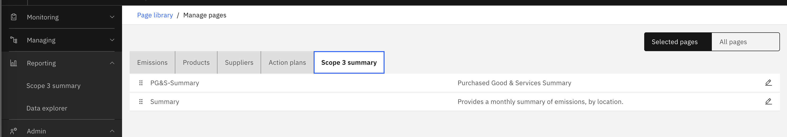

  - Click the pencil icon next to `Summary` to preview
 
  - Click `Copy` (top right) to create a new page
  

  

  - Name the new page `CG-Summary` (add a description if desired)

  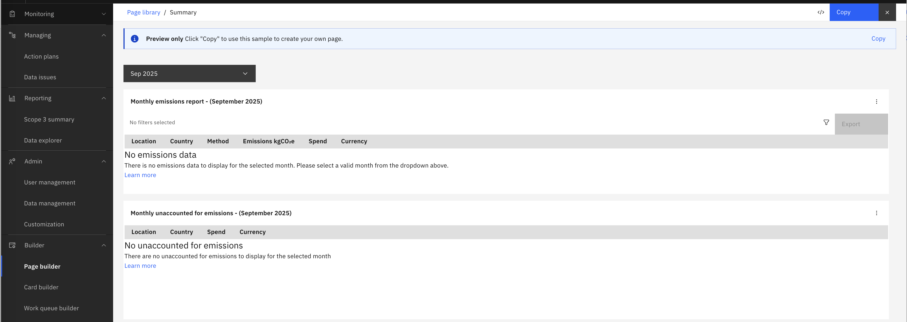

  - Click on `Create`

Step 5.2. **Configure the CG-Summary Page**
   
  - Click `Configure` on the new `CG-Summary` page
  

  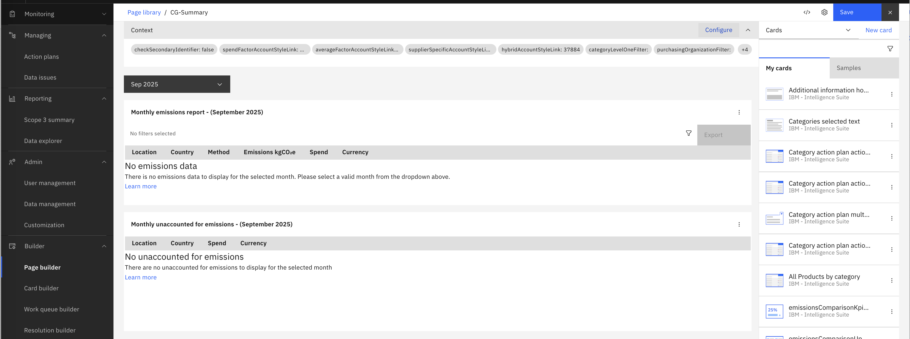

 
  - In the popup, review the context variables (these control the data displayed)

  

   
  - Set `categoryLevelOneFilter` to `CG` (ensure this matches your product data exactly)

  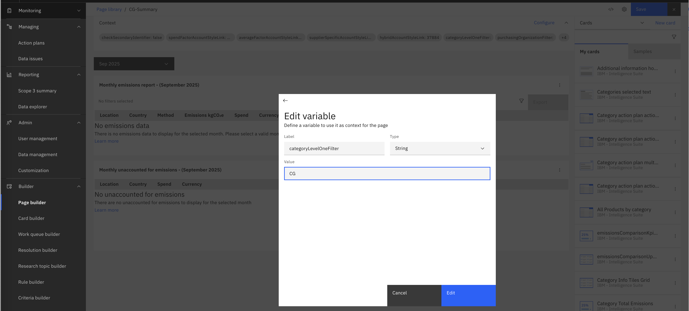

   
  - (Optional) Adjust `numberOfMonths` to specify the number of months for reporting data (e.g., 60)
  - (Optional) Set `accountNumberPrefix` (e.g., `scis-cg-`) to help organize accounts
  - (Required) Set `spendFactorAccountStyleLink`  to `38125`
  - (Required) Set `averageFactorAccountStyleLink`  to `38124`
  - (Required) Set `supplierSpecificAccountStyleLink` to `38127`
  - (Required) Set `hybridAccountStyleLink` to `38126`
 
 Note: Get the corresponding Account Style link values following the instructions from here.
[here](extractAccountStyleLinks.md)

  - Review your settings:

  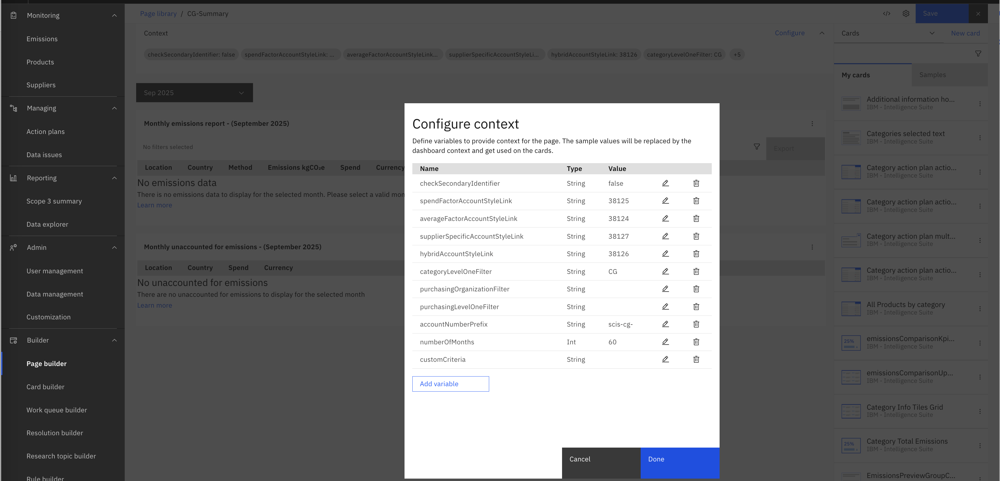

  - Click `Save`
  
Step 5.3. **View the CG-Summary page**

On the CG-Summary page, the context variables look like below 

  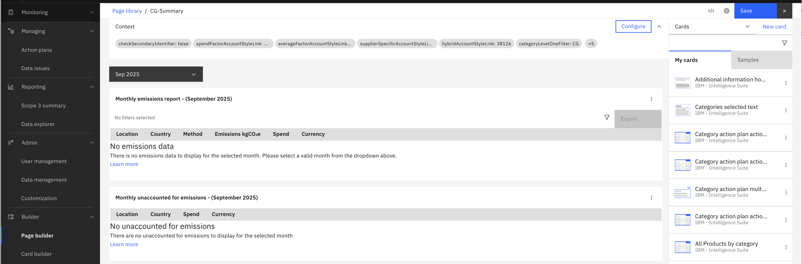

 

Step 5.4. **Access the Custom CG-Summary Report**
  - Go to `Reporting > Scope 3 Summary`
  - Select the `CG-Summary` tab
  - Choose a month to view emissions

  

