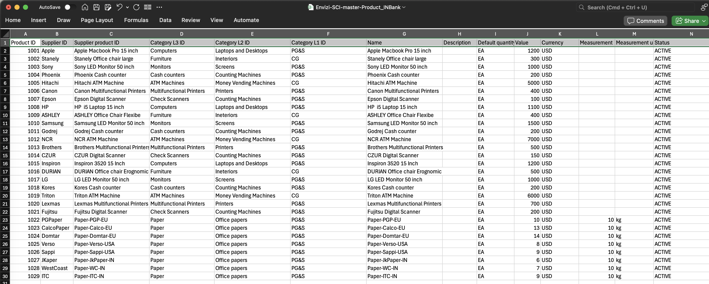
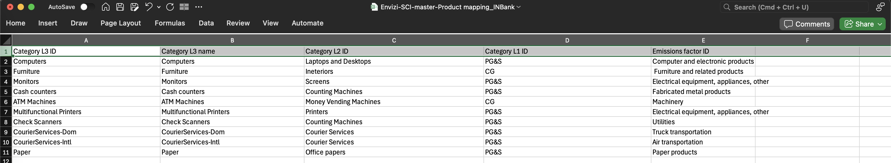

# Leverage SCI Advanced Configurations to Report Emissions by Custom Categories

This guide provides a clear, step-by-step approach for reporting and summarizing emissions in SCI (Supply Chain Intelligence) by custom categories—such as Category 1 (Purchased Goods & Services) and Category 2 (Capital Goods). This helps organizations meet detailed reporting and regulatory requirements with ease.

---

## 1. Why Separate Emissions by Scope 3 Category?

By default, SCI summarizes emissions in Scope 3 Summary dashboard on a monthly basis at the location level for each GHG (Greenhouse Gas) calculation method, such as:

- Spend-based
- Average-data
- Hybrid
- Supplier-specific

  

However, Some organizations require emissions to be reported separately for each Scope 3 category. For example, instead of exporting all spend-based emissions for all locations as a single group, you may need to break them down by specific categories.

The most common categories are:

- **Category 1:** Purchased Goods & Services (PG&S)
- **Category 2:** Capital Goods (CG)

The GHG protocol calculation logic is the same for both categories, so SCI can be configured to calculate and report them simultaneously.

There are two main approaches in SCI for capturing and reporting these categories separately:

1. **Purchasing organization-based approach**
2. **Product category-based approach**

For more details, see the [Envizi SCI documentation](https://www.ibm.com/docs/en/envizi-supply-chain?topic=configuration-configuring-category-1-2).

In this guide, we use the product category-based approach, as chosen by our example organization, IN Bank. The following sections explain how to achieve this in SCI.

## 1. Understanding the Default Envizi SCI Scope 3 Summary Dashboard

By default, the Scope 3 Summary dashboard in SCI summarizes emissions on a monthly basis at the location level for each GHG (Greenhouse Gas) calculation method, such as:

- Spend-based
- Average-data
- Hybrid
- Supplier-specific

  

In the example above, there are three locations:

- INBank-APAC-Ops
- INBank-EMEA-Ops
- INBank-US-Ops

Each location consolidates emissions by calculation method (e.g., "spend-based"). If other methods are used, the platform automatically groups emissions accordingly, so you may see multiple entries per location.

When you export these monthly emissions, an export job is created for each method and sent to Envizi automatically.

**Example export job:**

  

In Envizi, you can find the exported file under:

`Admin > Data Flow Automation > File Delivery Status`

  

Once the job is complete and the data is processed, you can view the results in the respective accounts for each location. For example, here is the data for `INBank-APAC-Ops`:

  

  

---

## 2. Summarizing Emissions for at Scope 3 Cat1 & Cat 2 seperately.

Now, lets look at steps to configure seperate reports for Category 1 PG&S and Cat 2 CG to meet the reporting requirements of INBank.

For this, INBank has chosen the approach 2 which is `Product category-based approach`. 

Lets start with the steps.

### 1. Model the product and product mapping template to align with the appraoch

The steps has to start from modelling the data from the begining. Now, INBank has modeled the product data by defining Category L1 ID as crieteria with the possible values PG&S and CG

Master Products data: 

  

 
Master Products Mapping data: 

  

### 2. Ingest master and transactional data 

Proceed with the other stepts to ingest master data and transactional data into the platform and verify the emissions are calculated

### 2. Ingest master and transactional data 
 

