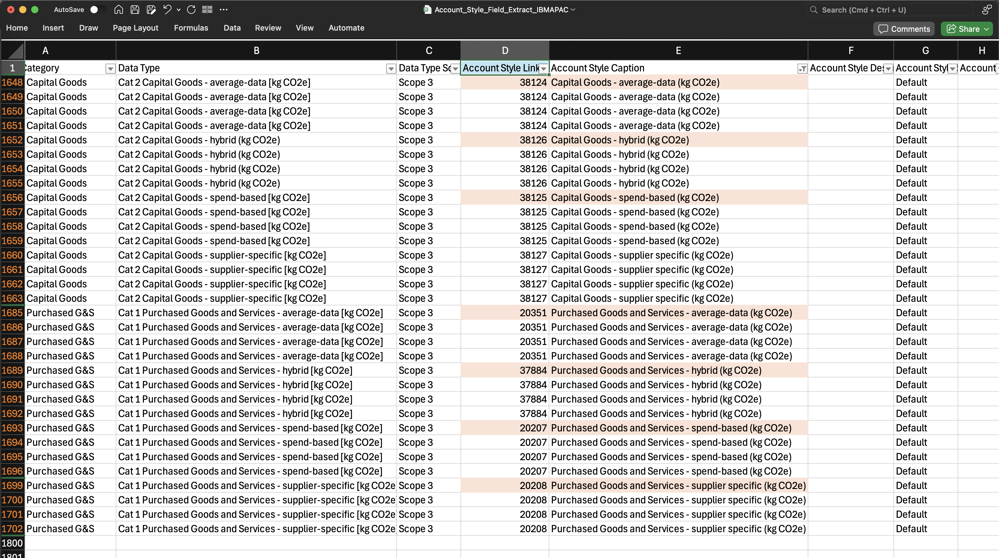

### Extract Account Style link values for Scope 3 Categories

There are different ways to find the account style link value for the given account styles in Envizi.  In this following  section, we will use `Account Style Field Extract` report to get the account style links which will be used in the SCI platform for Scope 3 Cat1 and Cat2.

1. Login to IBM Envizi
2. In global search, select `Reports`
3. Enter `field` in the search text box
4. Select report `Account Style Field Extract` 
5. Run the report 

  

 

6. Download csv to local system
7. Open `Account_Style_Field_Extract.csv` with xls 
8. Apply data filter on the column 
   Data Type Scope - Scope 3
9.  In the column `Account Style Caption`, get the value of `Account Style Link` for the below list of account styles
    #### Purchased Goods & Services    
    - Purchased Goods and Services - spend-based (kg CO2e) (e.g., 20207 )
    - Purchased Goods and Services - average-data (kg CO2e)  (e.g., 20351 )
    - Purchased Goods and Services - hybrid (kg CO2e)  (e.g., 37884 )
    - Purchased Goods and Services - supplier specific (kg CO2e)  (e.g., 20208 )
    #### Capital Goods
     - Capital Goods - spend-based (kg CO2e) (e.g., 38125 )
     - Capital Goods - average-data (kg CO2e) (e.g., 38124 )
     - Capital Goods - hybrid (kg CO2e) (e.g., 38126 )
     - Capital Goods - supplier specific (kg CO2e) (e.g., 38127 )

  

   

